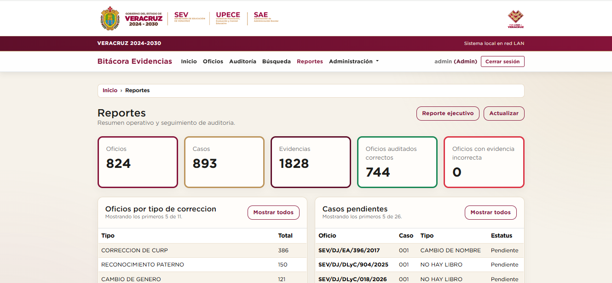

# Bitacora Evidencias

Sistema web local para registrar oficios, casos de correccion, evidencias fotograficas y revisiones de auditoria cuando una institucion necesita trazabilidad sin depender de hojas sueltas, carpetas compartidas y registros dispersos.

## El problema

En un proceso administrativo con oficios, casos por revisar y evidencias fotograficas, es facil perder el contexto: un caso puede quedar sin evidencia, una fotografia puede no coincidir con el registro, una correccion puede avanzar sin que exista historial claro, y la informacion sensible puede terminar en archivos o carpetas dificiles de controlar.

Este problema afecta a equipos operativos pequenos que trabajan en red local, con recursos limitados y necesidad de consultar rapidamente que oficio contiene cada caso, que evidencias existen, quien hizo cambios y que sigue pendiente. Sin una herramienta centralizada, el seguimiento depende de memoria, hojas de calculo, carpetas manuales y mensajes entre personas.

## La solucion

Bitacora Evidencias centraliza el flujo en una aplicacion ASP.NET Core Razor Pages:

1. Un usuario autenticado registra oficios.
2. Cada oficio agrupa casos de correccion con datos como nivel educativo, tipo de correccion, folio, estatus y auditor asignado.
3. Los casos pueden recibir evidencias fotograficas o ligas de evidencia.
4. El sistema organiza archivos en almacenamiento local, genera miniaturas y mantiene metadatos en SQLite.
5. La auditoria revisa casos y marca resultados como pendiente, coincidente o no coincidente.
6. Los reportes muestran pendientes, evidencia faltante, evidencia incorrecta y resumen ejecutivo.
7. Las acciones relevantes quedan registradas en bitacora de auditoria.

## Funcionalidades principales

- Inicio de sesion con cookies, roles `Admin` y `Capturista`, bloqueo por intentos fallidos y cambio obligatorio de contrasena temporal.
- Administracion de oficios, casos de correccion y evidencias fotograficas.
- Carga, reemplazo, eliminacion y visualizacion de evidencias con miniaturas.
- Busqueda de registros y panel principal con indicadores.
- Flujo de auditoria para revisar oficios y casos con evidencia.
- Reportes de casos pendientes, pendientes de evidencia, oficios por tipo de correccion, evidencia incorrecta y vista ejecutiva.
- Administracion de usuarios desde el rol `Admin`.
- Importacion tabular con vista previa para oficios, casos y evidencias.
- Bitacora de auditoria de acciones relevantes.
- Persistencia en SQLite mediante Entity Framework Core y migraciones.
- Proteccion opcional de datos sensibles mediante llave externa al repositorio.
- Scripts PowerShell para preparacion de base, respaldo, monitoreo, HTTPS, despliegue local, smoke tests y archivado de auditoria.

## Que mejora este proyecto

- Centraliza informacion que antes podria quedar repartida entre hojas, carpetas y notas.
- Reduce la posibilidad de oficios o casos sin seguimiento.
- Permite localizar casos por oficio, nivel, folio, CCT o datos relacionados sin revisar archivos manualmente.
- Ayuda a detectar evidencia faltante o incorrecta.
- Deja trazabilidad sobre accesos, cambios administrativos y operaciones relevantes.
- Mantiene evidencias binarias fuera de la base de datos y conserva metadatos relacionales.
- Se adapta a un escenario de red local con infraestructura limitada.

## Para quien esta pensado

El proyecto esta pensado para equipos administrativos u operativos que gestionan expedientes de correccion y evidencias en una instalacion local. El codigo define dos roles:

- `Admin`: administra usuarios, importaciones, bitacora, consultas SQL administrativas y configuracion operativa.
- `Capturista`: trabaja con el registro y consulta de oficios, casos, evidencias, busqueda, auditoria y reportes permitidos por la aplicacion.

## Capturas



## Tecnologias utilizadas

- ASP.NET Core Razor Pages sobre .NET 9 para la aplicacion web server-rendered.
- Entity Framework Core 9 con SQLite para persistencia local.
- Bootstrap, HTMX, jQuery y CSS propio para la interfaz.
- Tailwind CSS mediante un binario local en `tools/` para generar estilos de apoyo.
- PowerShell para scripts de operacion, despliegue local, respaldo, monitoreo y validacion.
- xUnit y Microsoft.AspNetCore.TestHost para pruebas automatizadas.
- Almacenamiento en filesystem para fotografias y miniaturas de evidencia.

## Requisitos

- .NET SDK 9.
- PowerShell si se van a usar los scripts incluidos.
- SQLite a traves del proveedor `Microsoft.EntityFrameworkCore.Sqlite`.
- Un navegador moderno.
- En Windows, los scripts de certificado y operacion local estan pensados para PowerShell.

No hay `package.json`; las librerias frontend principales estan incluidas bajo `wwwroot/lib/`.

## Instalacion

```powershell
git clone URL_DEL_REPOSITORIO
cd BitacoraEvidencias.Web
dotnet restore
```

Copia la configuracion de ejemplo si deseas trabajar con variables de entorno:

```powershell
Copy-Item .env.example .env
```

El archivo `.env` queda ignorado por Git. En PowerShell puedes cargar solo las variables que necesites para tu sesion, por ejemplo:

```powershell
$env:ASPNETCORE_ENVIRONMENT = "Development"
$env:ConnectionStrings__DefaultConnection = "Data Source=Data/bitacora-evidencias.dev.db"
$env:Storage__RootPath = "Storage"
$env:BITACORA_DATA_PROTECTION_KEY = "change_me_to_a_local_32_byte_or_base64_key"
```

## Configuracion

La configuracion base esta en `appsettings.json` y `appsettings.Development.json`. Para valores locales o sensibles usa variables de entorno o archivos ignorados por Git.

Variables importantes:

```env
ASPNETCORE_ENVIRONMENT=Development
ConnectionStrings__DefaultConnection=Data Source=Data/bitacora-evidencias.dev.db
Storage__RootPath=Storage
Security__BootstrapAdminPassword=
BITACORA_DATA_PROTECTION_KEY=change_me_to_a_local_32_byte_or_base64_key
BITACORA_HTTPS_CERT_PATH=C:\path\to\local-development-certificate.pfx
BITACORA_HTTPS_CERT_PASSWORD=your_local_certificate_password
```

- `ConnectionStrings__DefaultConnection`: ruta de la base SQLite.
- `Storage__RootPath`: carpeta donde se guardan evidencias y miniaturas.
- `Security__BootstrapAdminPassword`: contrasena temporal opcional para el primer usuario `admin`; si se deja vacia, la aplicacion genera una temporal sin registrarla en logs.
- `BITACORA_DATA_PROTECTION_KEY`: llave externa para proteger datos sensibles y evidencias.
- `BITACORA_HTTPS_CERT_PATH` y `BITACORA_HTTPS_CERT_PASSWORD`: certificado local usado por scripts HTTPS.

No guardes valores reales de produccion en `.env.example`, README, scripts ni archivos versionados.

## Base de datos

El proyecto usa SQLite. Las rutas por defecto son:

- Produccion/local base: `Data/bitacora-evidencias.db`.
- Desarrollo: `Data/bitacora-evidencias.dev.db`.

Las bases `.db`, `.db-wal` y `.db-shm` no deben publicarse. Para preparar una base local puedes usar:

```powershell
.\scripts\db\Initialize-BitacoraDatabase.ps1 -EnvironmentName Development -DataDbPath ".\Data\bitacora-evidencias.dev.db" -StorageRoot ".\Storage"
```

Tambien puedes iniciar la aplicacion una vez con:

```powershell
$env:Startup__PrepareApplicationData = "true"
$env:Startup__ExitAfterPrepareApplicationData = "true"
dotnet run
```

## Ejecutar el proyecto

```powershell
dotnet run
```

El perfil de lanzamiento incluido usa:

```text
https://127.0.0.1:5067
```

Si ejecutas con cookies seguras habilitadas, usa HTTPS.

## Uso

1. Inicia sesion con un usuario existente o prepara la base para crear el usuario bootstrap `admin`.
2. Cambia la contrasena temporal si la aplicacion lo solicita.
3. Registra un oficio con fecha, asunto y notas.
4. Agrega casos de correccion al oficio.
5. Carga evidencias fotograficas o registra ligas de evidencia.
6. Revisa los casos desde el modulo de auditoria.
7. Consulta busqueda, reportes y bitacora para seguimiento operativo.
8. Si eres `Admin`, administra usuarios e importaciones tabulares.

## Estructura

```text
Data/            DbContext, migraciones y configuracion de SQLite.
Models/          Entidades de dominio: oficios, casos, evidencias, usuarios y auditoria.
Pages/           Razor Pages de la aplicacion web.
Security/        Autenticacion auxiliar, hashing, roles y proteccion de datos sensibles.
Services/        Logica de aplicacion, almacenamiento, auditoria, importaciones y operaciones.
ViewComponents/  Componentes del dashboard.
wwwroot/         CSS, JavaScript, imagenes y librerias frontend.
scripts/         Automatizacion operativa en PowerShell.
tools/           Herramientas auxiliares locales del proyecto.
tests/           Pruebas automatizadas xUnit.
docs/            Documentacion tecnica y operativa.
```

## Seguridad

- No subas `.env`, bases SQLite reales, evidencias, respaldos, logs, certificados ni llaves privadas.
- Usa variables de entorno para secretos y configuracion sensible.
- Manten `BITACORA_DATA_PROTECTION_KEY` fuera del repositorio; perderla puede impedir leer datos protegidos.
- No publiques datos personales, CURP, CCT reales, folios privados, fotografias de evidencia ni reportes internos.
- Revisa `docs/GITHUB-PUBLISH-CHECKLIST.md` antes de publicar el repositorio.
- Reporta vulnerabilidades de forma responsable y sin incluir datos sensibles en issues publicos.

## Pruebas

Para ejecutar la suite automatizada:

```powershell
dotnet test
```

La carpeta `tests/BitacoraEvidencias.Web.Tests` contiene pruebas para servicios, seguridad, arranque e importaciones.

## Documentacion adicional

- `docs/ARCHITECTURE.md`: arquitectura general.
- `docs/SETUP.md`: puesta en marcha local.
- `docs/SECURITY.md`: controles y reglas de seguridad.
- `docs/PRIVACY-DATA.md`: manejo de datos privados.
- `docs/DEPLOYMENT.md`: despliegue local.
- `docs/OPERATIONS.md`: operacion diaria.
- `docs/TESTING.md`: pruebas.
- `docs/GITHUB-PUBLISH-CHECKLIST.md`: checklist antes de publicar.

## Estado del proyecto

El proyecto parece una version funcional en desarrollo, con flujos principales implementados, scripts operativos y pruebas automatizadas. No debe asumirse como listo para produccion publica sin una revision manual de infraestructura, datos reales, llaves, permisos del sistema operativo y procedimientos de respaldo.

## Limitaciones actuales

- Esta orientado a operacion local/LAN, no a despliegue cloud multiusuario de alta concurrencia.
- SQLite es adecuado para el escenario local, pero tiene limites de concurrencia frente a motores servidor.
- La continuidad depende de respaldos, custodia de llaves y restauracion operativa fuera del codigo.
- No se identifico una aplicacion movil.
- No se identifico recuperacion automatica de contrasena por correo.
- Las capturas publicas no estan incluidas.

## Proximas mejoras

- Agregar capturas anonimizadas en `docs/images/`.
- Documentar con mas detalle el flujo de restauracion para una maquina nueva.
- Incorporar revision automatizada de secretos en CI cuando exista repositorio GitHub.
- Evaluar exportaciones o reportes adicionales si el proceso operativo lo requiere.
- Formalizar una guia de hardening para permisos NTFS, respaldos y custodia de llaves.

## Contribuciones

1. Haz un fork del repositorio.
2. Crea una rama:

   ```powershell
   git checkout -b feature/nueva-funcionalidad
   ```

3. Realiza cambios pequenos y enfocados.
4. Ejecuta:

   ```powershell
   dotnet test
   ```

5. Revisa que no agregaste bases, logs, evidencias, secretos ni datos personales.
6. Abre un Pull Request explicando el problema que resuelve el cambio.

## Licencia

Este proyecto está publicado bajo licencia MIT. Consulta LICENSE para el texto completo.
